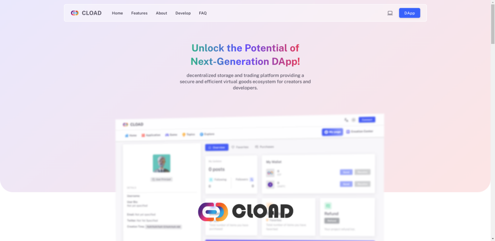

CLOAD User Manual
=============

Cload-teihaki Editor

Introduction
----

### 1.1 Introduction to CLOAD

(1) Hello everyone, as developers, besides software development, uploading software to app stores has always been a headache. High upload costs, complex review processes, and information barriers prevent users in different regions from downloading software normally. Furthermore, even if uploaded to an app store, the platform's high profit margins can drain developers' efforts. Our CLOAD platform was created to solve these problems.

(2) For ordinary users, CLOAD provides a completely reliable blockchain information encryption storage solution. You can use the crypto disk function to 100% encrypt and store files on the ICP blockchain, and you can also share files. In addition, CLOAD also has end-to-end encrypted communication capabilities, allowing you to communicate with other users via blockchain-encrypted messages without worrying about privacy leaks. Of course, you can also use the developer features mentioned above to encrypt and upload files for paid download by those who need them.

CLOAD ( <https://cload.one/> ) is an application built entirely on the ICP blockchain ( <https://internetcomputer.org/> ). It is positioned as a digital asset trading platform. You can think of CLOAD as a Steam or Google App Store built entirely on the blockchain. Through CLOAD, you can upload files (APPs) 100% to the blockchain, giving them various blockchain characteristics such as decentralization, immutability, and encryption. This allows your software to break down data barriers, enabling people from all over the world to download freely, and ensuring your data security.

### 1.2 Advantages of CLOAD over traditional app stores

  ---------- ---------- ------------
             STEAM      CLOAD
  Upload Fee 100\$      0\$
  Confirmation Fee 100\$      0\$
  Profit Share ≥30%       0%
  Review     Complex Review Simple Review
  Regional Restrictions Regional Restrictions No Regional Restrictions
  Data Security Data Leak Risk Immutable
  Centralization Centralized Decentralized
  Upload     1-2 weeks  10-20 minutes
  Privacy Protection Privacy Leak 100% Confidential
  Storage Cost 0\$        5\$/G/Y
  ---------- ---------- ------------

2.  How to Use
    --------

    1.  ### Login

        (1) Users can directly access the homepage via the website ( <https://cload.one/> )

        {width="5.759722222222222in"
        height="2.7993055555555557in"}

```{=html}
<!-- -->
```
2.  Enter the application by clicking DAPP in the upper right corner

    {width="5.759722222222222in"
    height="2.798611111111111in"}

3.  After entering the DAPP, users can log in to their account by clicking CONNECT in the upper right corner

    {width="5.759722222222222in"
    height="2.798611111111111in"}

4.  After clicking, log in using a bound email or a cryptocurrency wallet

    {width="5.759722222222222in"
    height="2.7993055555555557in"}

5.  After choosing your preferred login method, click creation center

    {width="5.759722222222222in"
    height="2.798611111111111in"}

6.  Deploying files 100% to the ICP blockchain requires consuming cycles. After entering the creation center, you can click CYCLES to view the remaining storage space, and click the remaining value button to recharge.

    {width="5.759722222222222in"
    height="2.798611111111111in"}

7.  CYCLES need to be converted using ICP tokens. Initial users will receive 0.5 Tcycles, and verified users will receive 5 Tcycles, which is enough to upload large game downloaders or directly upload small files.

    {width="5.759722222222222in"
    height="2.7993055555555557in"}

8.  Please ensure your CYCLES balance is sufficient, then click the 'PUSH' button to start project creation.

    {width="5.759722222222222in"
    height="2.798611111111111in"}

9.  Then enter the creation page and first enter the project description.

    {width="5.759722222222222in"
    height="2.7993055555555557in"}

10. After the project description is complete, click next to select appropriate tags for the project and further refine the information.

    {width="5.759722222222222in"
    height="2.7993055555555557in"}

11. After completion, click NEXT to upload images for the project, including LOGO, game screenshots, and other image information.

    {width="5.759722222222222in"
    height="2.7993055555555557in"}

12. After the images are uploaded, click CREATE to create the project. Once created, you can see the project.

    {width="5.759722222222222in"
    height="2.7993055555555557in"}

13. Then click manage to upload files for the project.

    {width="5.759722222222222in"
    height="2.798611111111111in"}

    {width="5.759722222222222in"
    height="2.798611111111111in"}

    {width="5.759722222222222in"
    height="2.798611111111111in"}

14. After uploading the files, click the 'GO LIVE' button to make your project visible to others, and click 'Take down' to hide the project.

    {width="5.759722222222222in"
    height="2.798611111111111in"}

15. Congratulations, you have successfully uploaded all files.

### 2.2 Project Certification

1.  If you have an original project, you can apply for certification to receive free cycles, official certification, and homepage exposure benefits. Click verified.

    {width="5.759722222222222in"
    height="2.798611111111111in"}

2.  Then you can contact us via the link for project certification.

    {width="5.759722222222222in"
    height="2.7993055555555557in"}

### 2.3 Free Cycles

1.  Please click 'my page' first, then click 'redeem code center'.

    {width="5.759722222222222in"
    height="2.798611111111111in"}
    (2) Then enter your redemption code to redeem 5 Tcycles.

    {width="5.759722222222222in"
    height="2.798611111111111in"}

2.  You can obtain free redemption codes through community managers or project certification.

### 2.4 Receiving and Sending Cryptocurrency

1.  You can see 'send or receive' on 'my page'.

    {width="5.759722222222222in"
    height="2.798611111111111in"}

2.  Click the corresponding option to send or receive cryptocurrency.

### 2.5 Changing Color Style and Language Selection

(1) To change the color, click the computer icon in the upper right corner to select.

{width="5.759722222222222in"
height="2.798611111111111in"}

You can click the image in the upper right corner to select the language.

{width="5.759722222222222in"
height="2.798611111111111in"}

**2.6 Encrypted Cloud Drive Function**

1.  Users can click Crypto Disk to enter the encrypted cloud drive page.

    {width="5.761111111111111in"
    height="2.814583333333333in"}

2.  Then click Upload to upload files.

    {width="5.761111111111111in"
    height="2.814583333333333in"}

3.  Click Browse Files to select and upload files.

    {width="5.759027777777778in"
    height="3.14375in"}

4.  After selecting the file, click Confirm Upload to upload the file.

    {width="5.761111111111111in"
    height="2.814583333333333in"}

5.  The file will then be sharded and encrypted and stored in different canisters. You can click the block to view specific information.

    {width="5.761805555555555in"
    height="2.814583333333333in"}

6.  After clicking, it will jump to the ICP dashboard to view the specific stored canister information.

    {width="5.761805555555555in"
    height="2.814583333333333in"}

    {width="5.761805555555555in"
    height="2.814583333333333in"}

7.  Return to crypto disk to view the file status.

    {width="5.761805555555555in"
    height="2.814583333333333in"}

8.  Click the icon to share files.

    {width="5.761111111111111in"
    height="2.814583333333333in"}

9.  Others can then download files via the link you shared.

    {width="5.761111111111111in"
    height="2.814583333333333in"}

    **2.7 Private Message Function**

```{=html}
<!-- -->
```
1.  On CLOAD, you can send end-to-end encrypted private messages to others. Only you and the message recipient can view the information. The transmission process is completely encrypted on the ICP blockchain using encryption algorithms.

2.  You can search for other users on the explore page.

    {width="5.761111111111111in"
    height="2.814583333333333in"}

3.  Then click, enter the user's homepage, and click message.

    {width="5.761111111111111in"
    height="2.814583333333333in"}

4.  Then the encrypted private message function can be completed.

    {width="5.761805555555555in"
    height="2.814583333333333in"}


